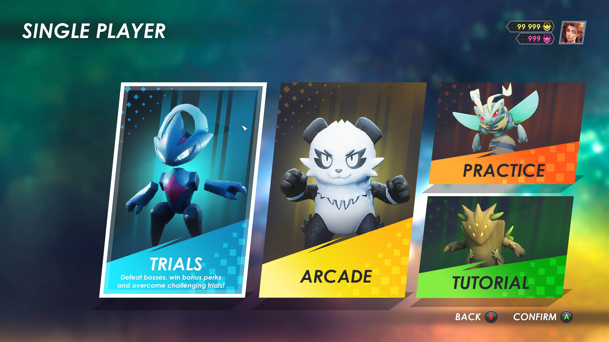

# ⚡ SkillGYM - Gamified Algorithmic Learning & Battle Arena

SkillGYM is a cyberpunk-themed, anime-arcade inspired competitive coding arena that transforms DSA and algorithmic problem solving into interactive multiplayer duels, territory conquests, and clan wars.



---

## 🌟 Key Features

### 1. ⚔️ Battle Arena & Match Modes
- **Ranked Territory Conquest Duel**: Live 1v1 tactical map conquest on a state outline grid. Players capture sectors by solving algorithmic problems and expanding connected borders.
- **Quick Code Sprint**: Fast 3-minute casual speed runs.
- **Practice Dojo**: Solo skill tree training across Arrays, DP, Trees, Graphs, and Hash Tables.
- **Tutorial Sandbox**: Interactive mechanics training and walkthroughs.

### 2. 🗺️ Ranked Territory Conquest Mode (`ranked.html`)
- **Tactical Map Screen**: Deep black tactical UI with crisp white state outline boundaries.
- **Faction Bases & Flags**: Blue Alliance (User 🏁 at West Base) vs. Red Syndicate (Rival 🚩 at East Core).
- **Frontline Adjacency Rule**: Players can only attack and conquer territories connected to their frontline.
- **In-Game Code Sandbox**: Embedded code editor with live test runner, pass/fail badge telemetry, and automated verification suites.
- **Dynamic Enemy AI**: Rival syndicate actively expands across bordering neutral territories.
- **Clash Scoreboard**: Real-time sector counts, ELO tracking, countdown timers, and victory/defeat resolution.

### 3. 🛡️ Syndicate Clans (`clan.html`)
- **Clan War Raids**: Weekly syndicate battles against rival clans with 50,000 CP pools.
- **Clan Info**: Shared algorithmic snippet vaults, player rosters, and CP leaderboards.
- **Confirmation Modals**: Interactive warning prompts and leaving/joining mechanics.

### 4. 🎧 Immersive Audio & Cyberpunk Aesthetics
- Web Audio synthesis engine for click crosshairs, button hums, battle fanfare, and victory sounds.
- Authentic arcade BGM controller featuring theme music and ambient atmospheric scanlines.

---

## 🚀 Quick Start

### Prerequisites
- [Node.js](https://nodejs.org/) (v18 or higher recommended)
- `npm`

### Installation
```bash
# Clone repository
git clone https://github.com/sherwinmoses01/SkillGYM.git
cd SkillGYM

# Install dependencies
npm install

# Start development server
npm run dev
```

Visit `http://localhost:5173` in your browser.

### Build for Production
```bash
npm run build
npm run preview
```

---

## 🛠️ Tech Stack
- **Bundler & Dev Server**: Vite (Multi-page HTML rollup configuration)
- **Styling**: Vanilla CSS with custom Cyberpunk Gaming design tokens, backdrop filters, and responsive layout
- **Logic & Evaluation**: ES6+ JavaScript, Dynamic code execution sandbox
- **Graphics**: SVG-based state outline polygons, glowing vector filters, and custom pixel overlays
- **Audio Engine**: Web Audio API Sound Synthesizer & BGM Player
